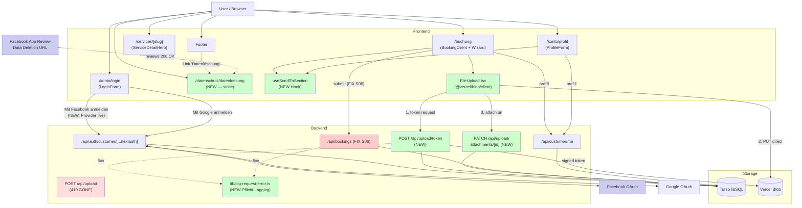
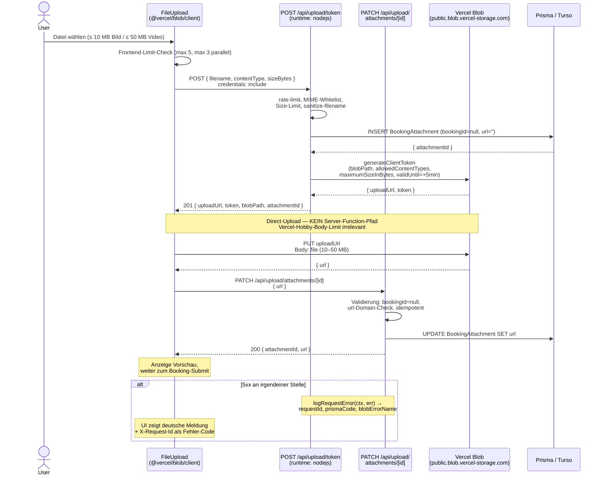

# Architecture — Iteration 13 Delta

> Stand: 2026-05-04. Änderungen relativ zu `ARCHITECTURE.md` (Stand IT12).
> Dieses Dokument beschreibt **nur die Iteration-13-Deltas**. Alle nicht
> hier aufgeführten Verträge gelten ARCHITECTURE.md unverändert.

---

## Komponenten-Diagramm (Delta-View)



Legende:
- Grün = neu in IT13.
- Rot = Bestand mit aktivem Production-Bug-Fix in IT13.
- Hell-Rot = deprecated in IT13 (410 GONE während Übergang).
- Blau = externe Abhängigkeit (Facebook), in IT13 erstmals produktiv aktiv.

---

## Sequence Diagram — Facebook OAuth Login (S02)

```mermaid
sequenceDiagram
    actor User
    participant FE as Frontend (LoginForm)
    participant NA as NextAuth Customer<br/>(/api/auth/customer/...)
    participant FB as Facebook OAuth
    participant DB as Turso<br/>(customer_users)
    participant FIN as oauth-finalize

    User->>FE: Klick "Mit Facebook anmelden"
    FE->>NA: GET /api/auth/customer/csrf
    NA-->>FE: { csrfToken }
    FE->>NA: POST /api/auth/customer/signin/facebook<br/>{ csrfToken, callbackUrl }
    NA-->>User: 302 → facebook.com/dialog/oauth
    User->>FB: Login & autorisiert App
    FB-->>NA: 302 → /api/auth/customer/callback/facebook<br/>?code=...
    NA->>FB: POST /oauth/access_token (exchange)
    FB-->>NA: { access_token }
    NA->>FB: GET /me?fields=id,email,name,first_name,last_name,picture
    FB-->>NA: { id, email, first_name, last_name, ... }

    NA->>NA: normalizeProfile('facebook', profile)
    alt email vorhanden
      NA->>DB: SELECT WHERE oauthProvider='facebook' AND oauthId=<fb_id>
      alt OAuth-Match
        DB-->>NA: existing user
      else E-Mail-Match (verifiziert)
        DB-->>NA: existing verified user
        NA->>DB: UPDATE oauthProvider='facebook', oauthId=<fb_id>
      else E-Mail-Match (unverifiziert)
        DB-->>NA: existing unverified
        NA-->>User: 302 /konto/login?error=oauth_unverified_conflict
      else neuer Account
        NA->>DB: INSERT customer_users (emailVerified=true)
      end
      NA-->>User: 302 /api/customer/oauth-finalize (NextAuth-Cookie kurz aktiv)
      User->>FIN: GET /api/customer/oauth-finalize
      FIN->>DB: SELECT customer by email
      FIN-->>User: Set-Cookie customer-session=<JWT, 7d>; 302 /konto
    else email fehlt
      NA-->>User: 302 /konto/login?error=oauth_no_email
    end
```

---

## Sequence Diagram — Upload-Direct-Upload-Refactor (S05)



> Hinweis: `POST /api/upload` (Server-Multipart) wird durch dieses
> Modell ersetzt; während der Übergangsphase antwortet er mit 410 GONE.

---

## Sequence Diagram — Bookings-Bug-Fix (S06)

```mermaid
sequenceDiagram
    actor User
    participant FE as BookingForm
    participant API as POST /api/bookings
    participant Prisma
    participant Turso as Turso libSQL
    participant Resend

    User->>FE: Submit Buchung
    FE->>API: POST { ...bookingData }<br/>Idempotency-Key: <uuid>

    API->>Prisma: lookupIdempotencyResponse(key)
    alt Cached
      Prisma->>Turso: SELECT idempotency_keys
      alt Tabelle fehlt (Migration-Drift)
        Turso-->>Prisma: P2021 The table 'idempotency_keys' does not exist
        Prisma-->>API: PrismaClientKnownRequestError
        API-->>FE: 500 INTERNAL_ERROR<br/>(KEIN Stack im Response,<br/>LOG: prismaCode=P2021)
        Note over Turso: IT13 FIX:<br/>turso db shell < migration.sql
      else Tabelle vorhanden, kein Cache
        Turso-->>Prisma: null
      else Cache-Hit
        Turso-->>Prisma: cached body
        API-->>FE: 200 cached body
      end
    end

    API->>API: rate-limit, json-parse, zod-validate
    API->>Prisma: SELECT customer_users (Adress-Pflicht-Check)
    API->>Prisma: createBookingWithOverlapCheck (serializable tx)
    Prisma->>Turso: BEGIN; SELECT bookings; INSERT; COMMIT
    alt Schema-Drift (z.B. cancelledAt fehlt)
      Turso-->>Prisma: P2022 column does not exist
      Prisma-->>API: error → internalError() → 500
      Note over API: IT13: prismaCode in Logs
    else OK
      Turso-->>Prisma: { id, ... }
      Prisma-->>API: created
      API->>API: signTokens (jose) — confirmation + cancellation
      API->>API: storeIdempotencyResponse (best-effort)
      API->>Resend: void runMailDispatch (fire-and-forget)
      API-->>FE: 201 { id, status, confirmationToken, cancellationToken }
    end
```

---

## Data Flow Notes (IT13)

### Auth-Provider-Routing (S02)

Der Customer-NextAuth-Handler hat den `basePath: '/api/auth/customer'`.
Die Provider-Callback-URLs sind daher:

- Google: `…/api/auth/customer/callback/google` (in IT12 produktiv).
- **Facebook: `…/api/auth/customer/callback/facebook` (NEU produktiv in IT13).**

Beide Provider gehen nach erfolgreichem Sign-In über die gemeinsame
Finalize-Route `/api/customer/oauth-finalize`, die das langlebige
`customer-session`-Cookie setzt. Der NextAuth-eigene Cookie
`__customer-next-auth.*` ist nur eine kurzlebige (60s) Brücke.

### Static-Page-Serving (S01)

`/datenschutz/datenloesung` ist eine statische Server-Component ohne
DB-Zugriff. Wird von Next.js zur Build-Zeit gerendert. Cache-Control
über App-Router-Default. Keine Vercel-Function-Invocation pro Aufruf.

### Scroll-Hook (S03)

Frontend-only. Public API ist `useScrollToSection(target)` (Hook,
nicht Funktion). Pflicht-Sequenz im Hook:
`requestAnimationFrame × 2 → scrollIntoView({ block: 'start' }) →
heading.focus({ preventScroll: true })`. Header-Höhe wird zur
Render-Zeit aus `[data-app-header]` gelesen. Modal-Branch via
`[data-modal-body]`-Erkennung (mit optionalem `[data-modal-header]`
für Modal-internen Sticky-Header). Kein Backend-State.

### Prefill (S04)

Der `useCustomer()`-Hook fetcht `GET /api/customer/me` pro
Component-Mount. Cache-Strategie: keine — `cache: 'no-store'`. Bei
Form-Mount im Wizard wird das Formular erst nach Erhalt der
Profil-Daten gerendert (Skeleton-Gating, kein Hydration-Mismatch).
Override-Verhalten: Form-State ist local, kein Auto-`PATCH /api/customer/me`.

---

## Integration Contract (Delta)

Alle Konventionen aus ARCHITECTURE.md §3.4 bleiben gültig. Iteration-13-
spezifische Ergänzungen:

### Neue Env-Vars

| Variable                    | Beispiel                | Pflicht für | Begründung |
|-----------------------------|-------------------------|-------------|------------|
| `AUTH_FACEBOOK_ID`          | `1234567890`            | Production (S02) | Facebook OAuth Provider. Akzeptiert auch `FACEBOOK_CLIENT_ID` als Alias. |
| `AUTH_FACEBOOK_SECRET`      | `abc…`                  | Production (S02) | Facebook OAuth Secret. Alias `FACEBOOK_CLIENT_SECRET`. |

Bestandsvariablen für die Bug-Fixes — alle bereits in ARCHITECTURE §10.2
dokumentiert, **müssen nach Re-Deploy verifiziert werden**:

- `BLOB_READ_WRITE_TOKEN` (S05) — Token muss auf den richtigen
  Blob-Store zeigen.
- `DATABASE_URL`, `BOOKING_TOKEN_SECRET`, `RESEND_API_KEY`,
  `MAIL_FROM`, `MAIL_TO_ADMIN`, `NEXTAUTH_URL`, `NEXT_PUBLIC_BASE_URL`
  (S06) — Vollständigkeit prüfen.

### Migrations-Status (S06)

Diese Migrationen MÜSSEN in der Production-DB
`baerenstark-prod` (Turso) eingespielt sein:

```
20260503163821_add_customer_address
20260504100000_add_booking_cancellation_audit
20260504120000_iteration_12_marketing
```

Verifikation:

```bash
turso db shell baerenstark-prod \
  "SELECT migration_name FROM _prisma_migrations \
   ORDER BY started_at DESC LIMIT 5"
```

### Logging-Konvention (S05/S06)

`internalError(err, route)` in `src/lib/api.ts` wird in IT13 ergänzt um:

- Auflesung von `err.code` (Prisma-Codes) und Logging als
  `prismaCode=Pxxxx`.
- Auflesung von `err.meta` (Prisma-Metadaten) und Logging als JSON.
- (Optional) `X-Request-Id` Response-Header für Vercel-Log-Korrelation.

Beispiel-Output (Vercel-Logs):

```
[POST /api/bookings] PrismaClientKnownRequestError: Invalid `prisma.booking.create()`
  prismaCode=P2022 meta={"column":"cancelledAt"}
```

### Facebook-Provider-Scopes

```
scope: email,public_profile
```

Komma-Trennung (Facebook-Konvention), nicht space-separated wie Google.

### Account-Linking-Regel (Multi-Provider)

`customer_users` hat single-valued `oauthProvider` / `oauthId`-Spalten.
Beim zweiten OAuth-Provider mit derselben verifizierten E-Mail wird die
Provider-Spalte überschrieben. Der Login mit dem alten Provider
funktioniert weiter über den E-Mail-Match-Pfad. **Bewusst akzeptiert.**

### URL-Konvention für Compliance-Pages

```
GET https://www.baerenstark-hausservice.app/datenschutz/datenloesung
→ 200 OK, statisch, kein Auth, ohne Trailing-Slash
```

Die in der Facebook Developer Console eingetragene URL ist exakt diese
(mit `www.`).

---

## Risiken & offene Punkte (IT13-spezifisch)

| Bereich                           | Risiko                                                         | Mitigation |
|-----------------------------------|----------------------------------------------------------------|------------|
| **Vercel-Hobby Body-Limit**       | 10 MB-Uploads triggern 413 vor unserem Code.                    | **Gelöst in IT13 durch Direct-Upload via `@vercel/blob/client`.** Server-Function-Pfad fällt weg. |
| **Multi-OAuth-Conflict**          | FB überschreibt Google-`oauthId` bei selber E-Mail.            | Akzeptiert; Login funktioniert über E-Mail-Match. Backlog: Multi-OAuth-Schema. |
| **Migration-Drift wiederholt**    | S06 ist die zweite Iteration mit diesem Bug (IT10 → IT13).      | IT13 Backlog: `scripts/migrate-turso.sh` Wrapper. |
| **Facebook ohne E-Mail**          | Pfad `oauth_no_email` blockiert Sign-In hart.                  | Akzeptiert für IT13. Backlog: Profile-Completion-Flow. |
| **Scroll-Hook Modal-Header**      | Modal-internen Header-Höhe korrekt erkannt?                    | Decision IT13: `[data-modal-header]` innerhalb `[data-modal-body]` als Sticky-Header-Marker. |
| **Pflicht-Logging-Coverage**      | Engineer könnte 5xx-Pfad ohne `logRequestError`-Aufruf erstellen. | Code-Review-Pflicht; Test-Helper im QA-Iteration prüft `X-Request-Id`-Header bei jeder 5xx-Response. |

---

## Iteration 13 — Top-Level-Änderungen für `ARCHITECTURE.md`

(Dies ist der Delta-Block, der unter §11 in `ARCHITECTURE.md` als
„IT13"-Eintrag eingefügt werden soll. Inhalt unten ist 1:1 für den
Append-Schritt.)

```markdown
**IT13 — Bug-Fix-Sweep + Facebook OAuth + Direct-Upload-Refactor (2026-05-04):**
Production-Bug-Sweep nach Tom's Stakeholder-Feedback nach IT12-Go-Live.
Zwei Production-Blocker strukturell behoben:
**`/api/upload` Refactor auf Direct-Upload via `@vercel/blob/client`**
— neue Endpoints `POST /api/upload/token` (signed Token, 5 min,
MIME/Size in Token eingebrannt) + `PATCH /api/upload/attachments/[id]`;
alter `POST /api/upload` antwortet während der Übergangsphase mit
410 GONE. Browser lädt Datei direkt zu Vercel Blob, Server-Function-
Body-Limit von Vercel Hobby (4.5 MB) ist damit irrelevant — 10-MB-Bilder
und 50-MB-Videos sauber möglich. **`/api/bookings` 500** (Prisma-
Migrations-Drift gegen Turso erneut — IT11 + IT12 Migrations nicht
vollständig eingespielt; manuelle Turso-Shell-Schritte nachgezogen).
**Strukturiertes Pflicht-Logging** in beiden Bug-Routen via neuem
`src/lib/log-request-error.ts`: jede 5xx-Antwort erzeugt einen single-
line `console.error`-Eintrag mit `requestId` (UUID), `prismaCode`/
`prismaMeta`, `resendCode`, `blobErrorName`, `authState`, `customerId`,
`endpoint`, `status`, `errorClass`, `message`. `internalError()` in
`src/lib/api.ts` erweitert: ruft intern `logRequestError` auf und gibt
`X-Request-Id`-Header zurück; FE zeigt diese ID dem Kunden bei 5xx zur
Support-Korrelation. UX-Bugs: **`useScrollToSection()`-Hook** neu in
`src/lib/scroll-to-section.ts` (Pflicht-Sequenz `requestAnimationFrame
× 2 → scrollIntoView → heading.focus({ preventScroll: true })`),
ersetzt `scroll-into-view.ts` (gelöscht). Header-Höhe via
`[data-app-header]`, Modal-aware via `[data-modal-body]` (mit
optionalem `[data-modal-header]` für Modal-internen Sticky-Header),
prefers-reduced-motion-konform, ±8 px Komfort-Tolerance. Form-Prefill
konsolidiert über `useCustomer()` in allen Forms (Buchungs-Wizard,
Profil) mit Skeleton-Gating gegen Hydration-Mismatch. **Service-
Detail-Bilder** (`/services/[slug]`): Drei-Schicht-Modell —
Outer-Wrapper `bg-baerenstark-cream/60` (Letterbox-Token),
Image-Container `bg-transparent`, `<Image>`
`bg-transparent object-contain` mit `max-h-[28rem]` (Stories
S07/S08). **Compliance:** neue statische Server-Component-Page
`/datenschutz/datenloesung` (kein Backend-State) als Voraussetzung
für Facebook App Review live; Footer-Link „Datenlöschung" +
Datenschutz-Seite-Abschnitt mit Querverweis. **Facebook OAuth
produktiv aktiv** (Provider in `src/lib/customer-oauth.ts` schon
seit IT6 registriert, IT13 erstmals live): ENV-Naming auf
`AUTH_FACEBOOK_ID`/`AUTH_FACEBOOK_SECRET` harmonisiert (mit Alias-
Akzeptanz für `FACEBOOK_CLIENT_ID/SECRET`), Scope-String auf
`'email,public_profile'` (Facebook-Komma-Konvention), Redirect-URI in
Facebook Developer Console exakt
`https://www.baerenstark-hausservice.app/api/auth/customer/callback/facebook`
(mit `customer/`-Pfadsegment — kein Tippfehler). Account-Linking
konsistent mit Google: verifiziert → auto-link, unverifiziert → 422
`oauth_unverified_conflict` (Hijacking-Schutz). Single-Valued
`oauthProvider`-Spalte: bei Multi-OAuth wird überschrieben — Login
funktioniert weiter über E-Mail-Match-Pfad (akzeptierter Trade-off;
Multi-OAuth-Schema bleibt im Backlog).
```
