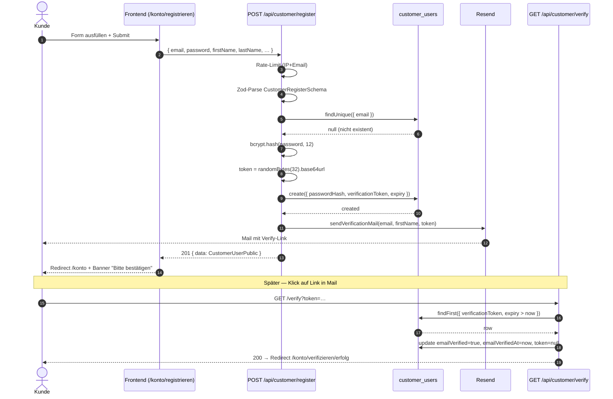
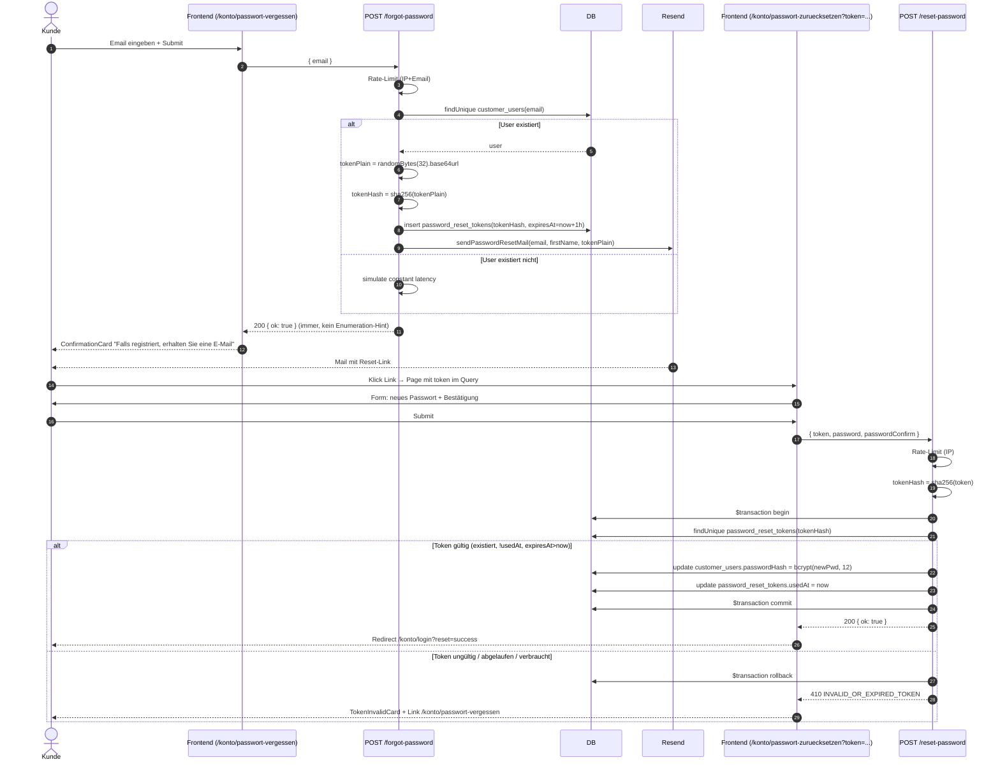
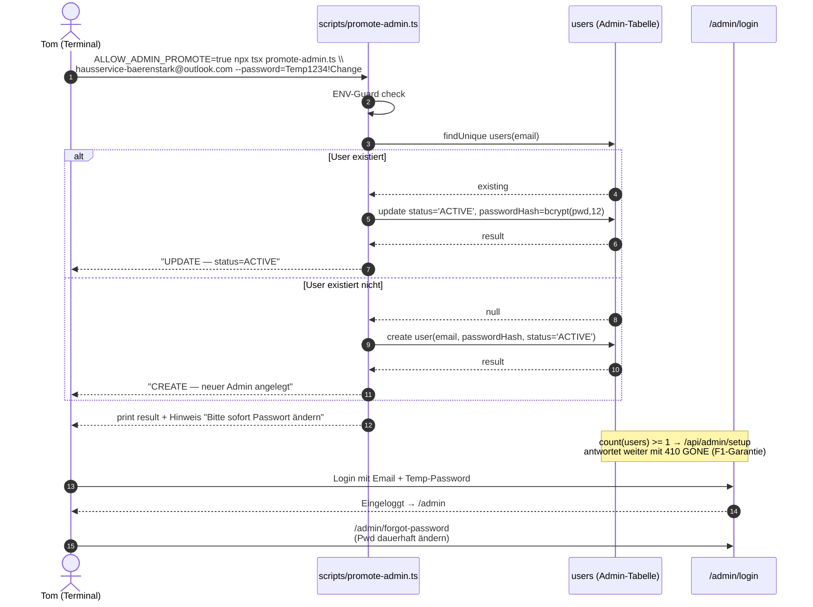

# System Architecture — Iteration 7 (Auth-Stabilisierung & Email-Auth-Reversion)

> Quelle der Wahrheit: `ARCHITECTURE_IT7.md`. Dieses Dokument zeigt
> Komponenten und kritische Flows für IT7. Alle vorherigen
> IT1–IT6-Architektur-Entscheidungen bleiben aktiv.

## Component Diagram

```mermaid
graph TB
    User["Kunde / Browser"]
    Tom["Tom (Admin) / Engineer"]

    subgraph Frontend["Next.js Frontend (Vercel)"]
      LoginPage["/konto/login<br/>Credentials + OAuth"]
      RegPage["/konto/registrieren"]
      VerifyPage["/konto/verifizieren"]
      ForgotPage["/konto/passwort-vergessen"]
      ResetPage["/konto/passwort-zuruecksetzen"]
      KontoLayout["/konto/layout<br/>UnverifiedEmailBanner"]
      AdminPages["/admin/*"]
    end

    subgraph BackendAPI["Next.js Route Handlers (Node, /api)"]
      direction TB
      RegEP["POST /customer/register"]
      LoginEP["POST /customer/login"]
      VerifyEP["GET  /customer/verify"]
      ResendEP["POST /customer/resend-verification"]
      ForgotEP["POST /customer/forgot-password"]
      ResetEP["POST /customer/reset-password"]
      DiagEP["GET  /api/auth/diagnose<br/>(Dev-only, 404 in Prod)"]
      OAuthC["NextAuth Customer<br/>/api/auth/customer/[...]"]
      OAuthA["NextAuth Admin<br/>/api/auth/[...]"]
    end

    subgraph Lib["Backend-Bibliotheken"]
      AuthCfg["lib/auth.ts<br/>(Admin Credentials)"]
      OAuthCfg["lib/customer-oauth.ts<br/>(Credentials + Google + Facebook)"]
      Mail["lib/mail.ts<br/>sendVerificationMail<br/>sendPasswordResetMail"]
      Rate["lib/ratelimit.ts<br/>(Upstash, optional)"]
      DTO["lib/dto/user.ts<br/>selectCustomerUserPublic()"]
      Tokens["crypto<br/>randomBytes + sha256Hex"]
      Bcrypt["bcryptjs<br/>cost 12"]
    end

    subgraph CLI["CLI-Skripte (lokal, Pair mit Tom)"]
      Promote["scripts/promote-admin.ts<br/>ENV: ALLOW_ADMIN_PROMOTE=true"]
      Wipe["scripts/reset-users.ts<br/>(IT6, ALLOW_USER_WIPE=true)"]
      DTOLint["scripts/check-dto-leaks.ts<br/>(CI)"]
    end

    subgraph DB["libSQL / Turso (SQLite)"]
      Users["users<br/>(Admin)"]
      CustUsers["customer_users<br/>+ emailVerifiedAt (NEU)"]
      ResetTokens["password_reset_tokens<br/>(NEU IT7)"]
      Bookings["bookings"]
      Reviews["reviews"]
      Payments["payments"]
    end

    subgraph External["Externe Provider"]
      Google["Google OAuth"]
      Facebook["Facebook OAuth"]
      Resend["Resend Mail API"]
      Upstash["Upstash Redis"]
      Stripe["Stripe API"]
    end

    User --> LoginPage
    User --> RegPage
    User --> ForgotPage
    User --> ResetPage
    User --> VerifyPage
    User --> KontoLayout
    Tom --> AdminPages
    Tom --> Promote
    Tom --> DiagEP
    Tom --> Wipe

    LoginPage --> LoginEP
    LoginPage --> OAuthC
    RegPage --> RegEP
    VerifyPage --> VerifyEP
    ForgotPage --> ForgotEP
    ResetPage --> ResetEP
    KontoLayout --> ResendEP
    AdminPages --> OAuthA

    RegEP --> Bcrypt
    RegEP --> Tokens
    RegEP --> Mail
    RegEP --> Rate
    RegEP --> CustUsers

    LoginEP --> Bcrypt
    LoginEP --> Rate
    LoginEP --> CustUsers
    LoginEP --> DTO

    VerifyEP --> CustUsers
    VerifyEP --> Rate

    ResendEP --> Mail
    ResendEP --> Tokens
    ResendEP --> Rate
    ResendEP --> CustUsers

    ForgotEP --> Tokens
    ForgotEP --> Mail
    ForgotEP --> Rate
    ForgotEP --> CustUsers
    ForgotEP --> ResetTokens

    ResetEP --> Bcrypt
    ResetEP --> Tokens
    ResetEP --> Rate
    ResetEP --> CustUsers
    ResetEP --> ResetTokens

    OAuthC --> OAuthCfg
    OAuthCfg --> Google
    OAuthCfg --> Facebook
    OAuthCfg --> CustUsers

    OAuthA --> AuthCfg
    AuthCfg --> Users

    Mail --> Resend
    Rate --> Upstash

    Promote --> Bcrypt
    Promote --> Users

    DTOLint --> DTO

    Stripe -.- Payments
```



## Sequence Diagram — Customer-Registrierung + Email-Verifikation (US-IT7-01)



## Sequence Diagram — Passwort-Reset E2E (US-IT7-05)



## Sequence Diagram — Admin-Lock-out-Recovery via Promote-Skript (US-IT7-04)



## Data Flow Notes

### Customer-Login (Email/Password) — Variante A (empfohlen)

1. Frontend `<LoginForm />` → `POST /api/customer/login` mit
   `CustomerLoginSchema`-Body.
2. Backend prüft Rate-Limit, validiert Body, findet User (oder
   simuliert bcrypt-Latenz für nicht-existenten User).
3. `bcrypt.compare()` — bei Mismatch oder `passwordHash=NULL` ↦ 401/422.
4. Bei Erfolg: `safeCustomerCallback()` validiert `redirectUrl` →
   `customer-session`-Cookie wird vom Login-Endpoint direkt gesetzt
   (kein Finalize-Roundtrip).
5. Response `CustomerLoginResponseSchema` enthält Public-DTO + sicheren
   `redirectUrl`. Frontend macht `router.push(redirectUrl)`.

### Customer-Login OAuth (Google / Facebook)

1. Frontend → `signIn('google', …)` → NextAuth-Customer-Handler.
2. NextAuth redirect zu Provider, Provider redirect zurück nach
   `/api/auth/customer/callback/<provider>`.
3. NextAuth `signIn`-Callback ruft `handleCustomerOAuthSignIn()` auf,
   das den User findet/anlegt (mit `emailVerified=true` für OAuth).
4. NextAuth `redirect`-Callback leitet zu
   `/api/customer/oauth-finalize` (Open-Redirect-Schutz).
5. Finalize-Route liest die kurze NextAuth-Session, schreibt das
   langlebige `customer-session`-Cookie, redirect zu `/konto`.

### Email-Enumeration-Schutz

`POST /api/customer/forgot-password` antwortet **immer** 200 mit
`{ ok: true }`. Bei nicht-existentem User wird **kein** DB-Insert und
**kein** Mail-Versand getriggert, aber Latenz wird simuliert (z.B.
`bcrypt.compare` Dummy oder `await sleep(150)`). Damit kann ein
Angreifer weder über HTTP-Status, Body-Größe noch Latenz erkennen, ob
ein Email-Konto existiert.

### Token-Storage

Reset-Tokens werden niemals im Klartext persistiert. Frontend bekommt
den Klartext nur in der Reset-Mail. Datenbank speichert ausschließlich
den SHA-256-Hex-Digest. Bei Lookup hashes der Server den eingehenden
Klartext ebenfalls und vergleicht via UNIQUE-Lookup auf `tokenHash`.

## Integration Contract

- **Transport:** REST/JSON über HTTPS.
- **Auth:**
  - Customer: Cookie `customer-session` (langlebig, JWT, signiert).
  - Customer-OAuth-Brücke: Cookie `__customer-next-auth.session-token` (60s, NextAuth-intern).
  - Admin: Cookie `next-auth.session-token` (NextAuth-managed).
- **Content-Type:** `application/json; charset=utf-8`.
- **Error format (verbindlich):**
  ```json
  { "error": { "code": "INVALID_OR_EXPIRED_TOKEN", "message": "Dieser Link ist nicht mehr gültig." } }
  ```
  Codes-Liste IT7-Erweiterung: `INVALID_OR_EXPIRED_TOKEN` (410),
  `EMAIL_ALREADY_REGISTERED` (409), `OAUTH_ONLY_ACCOUNT` (422),
  `ALREADY_VERIFIED` (409), `RATE_LIMITED` (429),
  `INVALID_CREDENTIALS` (401). IT6-Codes (`ACCOUNT_DISABLED`,
  `LAST_ADMIN_LOCK`, `SELF_MUTATION_FORBIDDEN`,
  `BOOTSTRAP_NOT_ALLOWED`, `SETUP_NOT_CONFIGURED`,
  `BOOKING_NOT_COMPLETED`, `REVIEW_EXISTS`) bleiben aktiv.
- **Pagination:** `?page=N&limit=N` → `{ data, total, page }` (IT4-Pattern, unverändert).
- **Timestamps:** ISO 8601 mit Offset (`2026-05-03T12:34:56+02:00`).
- **IDs:** `cuid()` (Default für Prisma-Modelle); `tokenHash` ist
  SHA-256 hex (64 chars) für `password_reset_tokens`.
- **Email:** lowercase, getrimmt, max 254 chars.
- **Passwort:** min 8 (Customer), min 12 (Admin via Promote-Skript),
  max 200. Bcrypt cost 12.
- **DTO-Garantie (F3 + IT7-Erweiterung):** Customer-Endpoints
  durchlaufen IMMER `selectCustomerUserPublic()` + `toCustomerPublic()`
  + `CustomerUserPublicSchema.strict()`. Felder `passwordHash`,
  `verificationToken`, `verificationTokenExpiry`, `oauthId`,
  `adminNote`, `adminRating` werden NIEMALS ausgespielt.
- **Rate-Limits:** verbindlich in `contracts/api-routes.md` §23.5.
- **Diagnose-Endpoint:** `GET /api/auth/diagnose` antwortet **nur** in
  Dev-Mode mit Bool-Flags zu ENVs/Provider-Aktivität. In Prod 404.

## File Inventory (gesamt IT7)

Verbindlich, siehe `frontend-requirements.md` und `backend-requirements.md`
für vollständige Listen. Zusammenfassung:

- **Neu:** 7 API-Routes (6 Customer-Auth + Diagnose), 1 CLI-Skript,
  4 Frontend-Pages, 7 Frontend-Components, 1 Migration, 1 Tabelle.
- **Update:** 4 Lib-Dateien, 1 Layout, 1 Login-Form, 3 Contract-Dokumente,
  1 Runbook, 1 ENV-Example.
