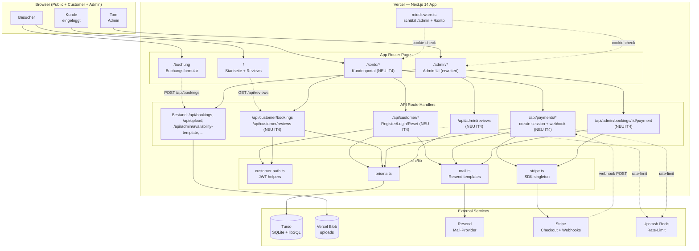
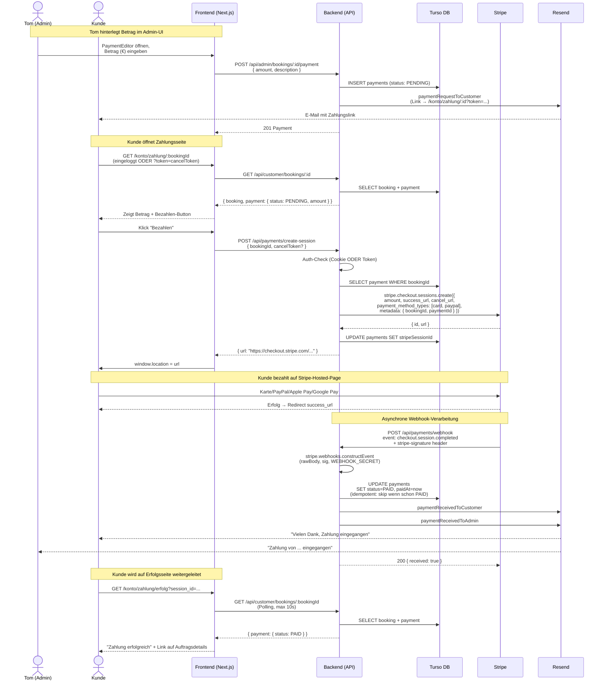
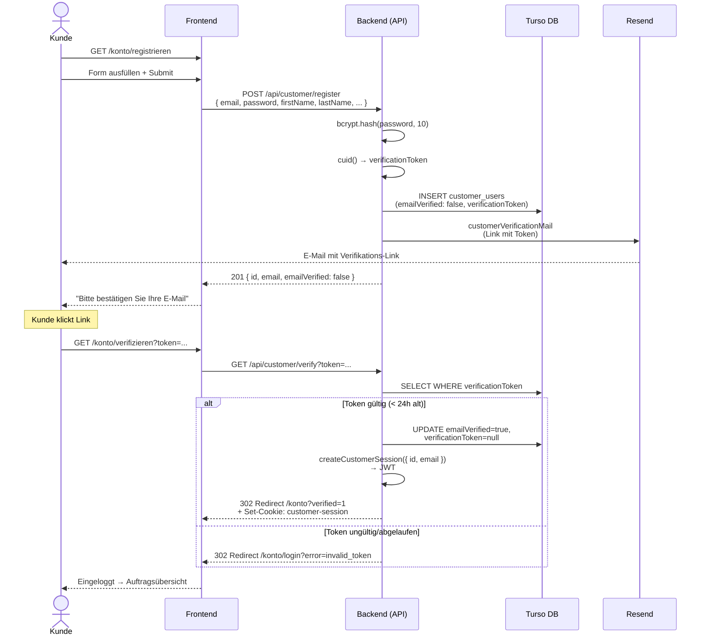
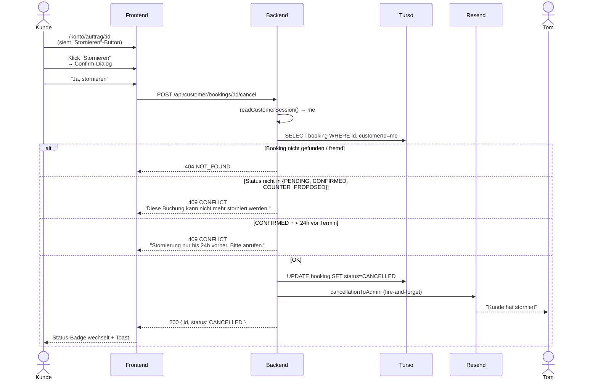

# System Architecture — Iteration 4

Erweiterung der Bestand-Architektur (IT1–IT3) um **Kundenportal**,
**Stripe-Zahlungen** und **Bewertungs-Backend**. Alles bleibt im
Vercel-deployten Next.js-Monolith — keine Microservices.

## Component Diagram



## Sequence Diagram — Kunden-Zahlung (US-28)

Der wichtigste neue Flow in IT4: ein Kunde bezahlt einen vom Admin
hinterlegten Betrag.



## Sequence Diagram — Kunden-Registrierung & Verifikation (US-25)



## Sequence Diagram — Stornierung mit 24h-Check (US-27)



## Data Flow Notes

### `customer-session`-Cookie

- Vom Backend ausgestellt bei `POST /api/customer/login` und nach
  erfolgreicher `GET /api/customer/verify`.
- Vom Frontend nur indirekt sichtbar (httpOnly = nicht via JS lesbar).
- Bei jedem Request zu `/konto/*` und `/api/customer/*` automatisch
  mitgesendet (Browser-Default).
- Inhalt: signiertes JWT mit `{ customerId, email, iat, exp }`.

### Booking-Customer-Zuordnung

- Beim `POST /api/bookings`: Backend liest `customer-session`-Cookie
  via `readCustomerSession()` und befüllt `customerId` automatisch.
  Frontend sendet **kein** zusätzliches Feld.
- Bei eingeloggter Buchung: `bookings.customerId !== null`.
- Bei Gastbuchung: `bookings.customerId === null` (sichtbar nur im
  Admin-UI, nicht im Kundenportal).

### Stripe-Webhook-Idempotenz

- Stripe-Webhooks können **mehrfach** ankommen (bei Timeout, Retry).
- Backend prüft vor jedem Status-Update, ob der Status schon gesetzt ist.
- `paymentReceivedToCustomer` + `paymentReceivedToAdmin` werden nur
  beim **ersten** PENDING → PAID-Übergang gesendet.

### Review-Sichtbarkeit

- `POST /api/customer/reviews` legt mit `approved: false` an.
- Tom sieht in `/admin/reviews` (Tab "Wartend") alle pending Reviews.
- Nach `PATCH /api/admin/reviews/:id { approved: true }` wird die
  Review von `GET /api/reviews` ausgeliefert.
- `<ReviewSection>` auf der Startseite ersetzt die statischen IT3-Daten,
  sobald `total >= 4` echte (approved) Reviews vorliegen.

## Integration Contract

Verbindlich für FE und BE. Mehrteilige Konventionen für IT4-spezifische
Aspekte ergänzen den Bestand-Vertrag aus IT1–IT3.

### Transport
- HTTPS in Production. JSON für Bodies (außer `/api/upload`:
  multipart/form-data; `/api/payments/webhook`: rohes JSON ohne
  unser Pre-Parse — Stripe-Signatur).

### Auth-Header / Cookie
- **Admin (Bestand):** `next-auth.session-token` Cookie (NextAuth).
- **Kunde (NEU IT4):** `customer-session` Cookie (eigenes JWT).
- **Token-Auth (Bestand IT2):** `?token=cancelToken` Query.
- **Stripe-Webhook (NEU IT4):** `stripe-signature` Header
  (Validierung gegen `STRIPE_WEBHOOK_SECRET`).

### Error-Format

Unverändert seit IT2:

```json
{ "error": { "code": "VALIDATION_ERROR", "message": "...", "field": "email" } }
```

Neue Codes IT4: `EMAIL_NOT_VERIFIED` (422), `STRIPE_ERROR` (502).
Vollständige Liste siehe `contracts/zod-schemas.ts.ApiErrorSchema`.

### Pagination

Im MVP nicht erzwungen. `GET /api/reviews` akzeptiert optional
`?limit=N` (1–100, Default 20). Andere Listen ohne Pagination
(erwartete Mengen < 100).

### Timestamps
- Alle DateTime-Werte im API-Response: ISO 8601 mit Offset (Z-Suffix).
- Customer-side Datums-Strings für Termine: `"YYYY-MM-DD"` (Berlin-TZ),
  `"HH:MM"` (Bestand IT3).

### IDs
- Alle IDs: `cuid` (Strings).
- Stripe-Session-IDs: `cs_test_...` / `cs_live_...` — werden separat in
  `payments.stripeSessionId` persistiert.
- Cancel-/Reset-/Verification-Tokens: `cuid()` erzeugt.

### Beträge
- **Im API-Wire-Format:** Cents als Integer (`amount: 14000` = 140,00 €).
- **In der UI:** Euro mit `Intl.NumberFormat('de-DE', { style: 'currency', currency: 'EUR' })`.
- Frontend rechnet Euro → Cents via `Math.round(parseFloat(eurInput) * 100)`.

### Stripe-Checkout-Session-Konvention
- `mode: 'payment'` (one-time, kein Subscription).
- `payment_method_types: ['card', 'paypal']` — Apple Pay / Google Pay
  laufen automatisch über `card`, sofern im Stripe-Dashboard aktiviert.
- `success_url`: `${BASE_URL}/konto/zahlung/erfolg?session_id={CHECKOUT_SESSION_ID}`.
- `cancel_url`: `${BASE_URL}/konto/zahlung/${bookingId}`.
- `metadata`: `{ bookingId, paymentId }` — Webhook-Handler nutzt das
  zum Lookup.
- `customer_email`: vorab aus Booking gefüllt (Kunde muss nicht erneut
  eingeben).
- `locale: 'de'`.

### Customer-Session-JWT

```
Algorithm: HS256
Secret:    AUTH_SECRET (32+ Zeichen Random)
Payload:   { customerId: string, email: string, iat: number, exp: number }
Lifetime:  7 Tage (604800 s)
```

Der Token wird **nicht serverseitig persistiert** (kein Token-Store). Bei
Logout wird das Cookie nur clientseitig gelöscht — bestehende JWTs
bleiben bis zum exp gültig (akzeptabler MVP-Trade-off).

### Webhook-Endpoint-Anforderungen

- Path: `/api/payments/webhook`.
- Methode: POST.
- Authentication: ausschließlich Stripe-Signatur (`stripe-signature`
  Header).
- Body-Parsing: **rohes** Text-Reading (`await req.text()`) vor
  Signatur-Check. Kein Next.js-JSON-Auto-Parse zulassen.
- Antwort: 200 `{ received: true }` bei Erfolg; 400 bei Signatur-Fehler.
- Idempotenz: Status-Check vor Update; doppelte Events liefern 200, kein
  zweiter Mail-Versand.

### `/konto/*`-Routing-Vertrag

Public-Whitelist (kein Login nötig):

- `/konto/login`
- `/konto/registrieren`
- `/konto/passwort-vergessen`
- `/konto/passwort-zuruecksetzen?token=...`
- `/konto/verifizieren?token=...`
- `/konto/zahlung/:bookingId?token=...` (mit Token: öffentlich;
  ohne: Login-Pflicht)

Alle anderen `/konto/*`-Pfade → Middleware-Redirect auf
`/konto/login?callbackUrl=<original-path>`.
